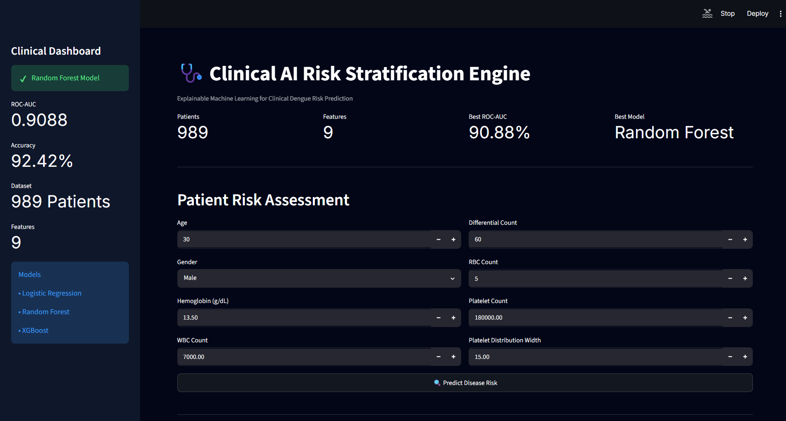
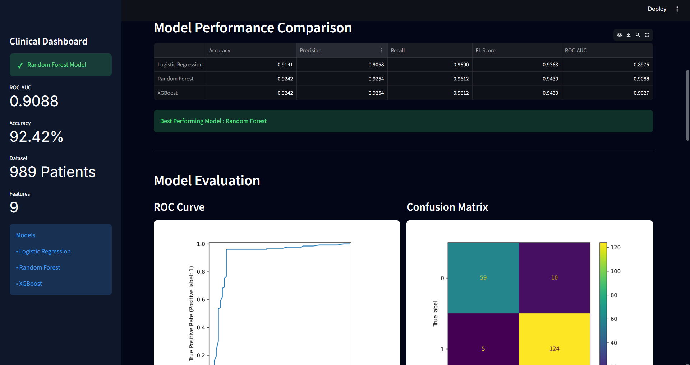
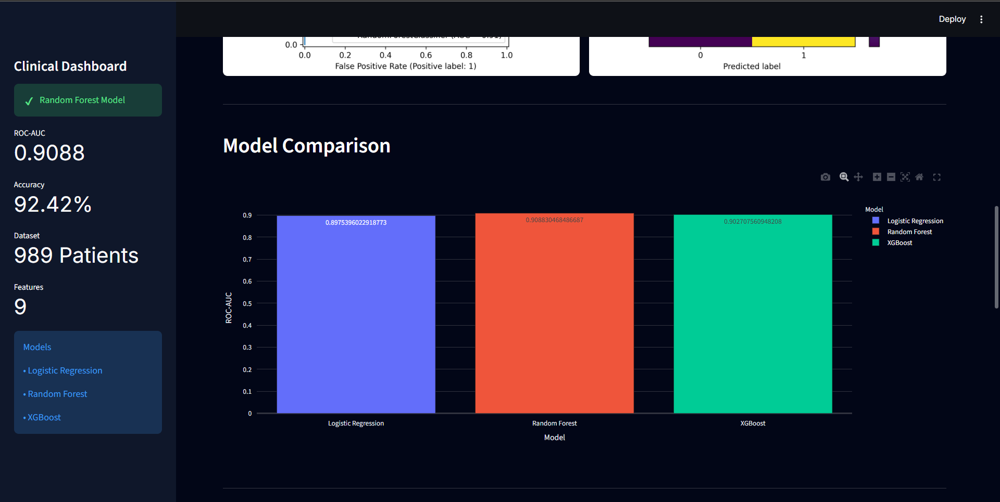
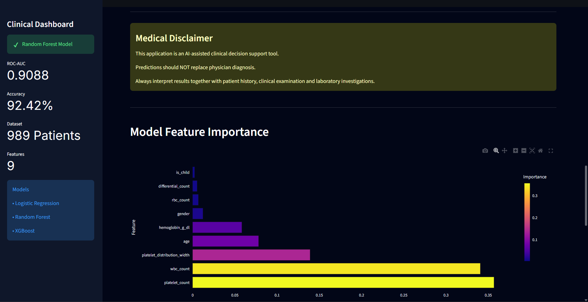
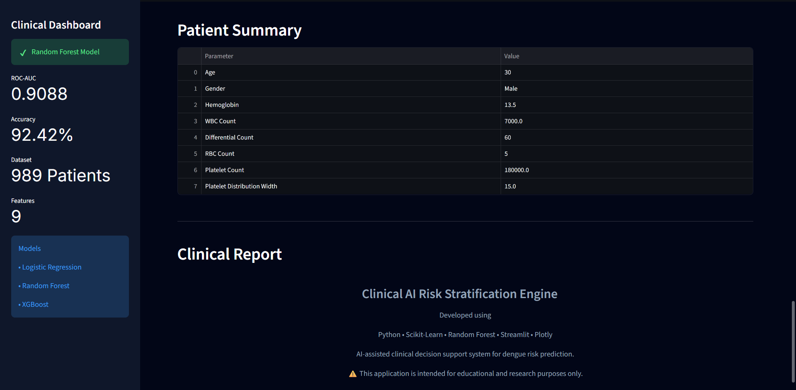

# Clinical AI Risk Stratification Engine

<p align="center">
  
  
  
  
  
  
</p>

<p align="center">
  
  
  
  
  
</p>

<p align="center">
  <strong>Explainable Machine Learning for Clinical Dengue Risk Prediction</strong><br/>
  An end-to-end ML pipeline that trains and compares three classification models on patient laboratory data, then deploys the best model as an interactive Streamlit clinical decision support tool.
</p>

---

## Overview

Dengue fever affects an estimated 400 million people annually across tropical and subtropical regions. Early identification of high-risk patients is critical — platelet count and WBC levels begin to shift days before clinical severity becomes apparent, making laboratory-based AI screening a practical early-warning tool.

This project builds a complete machine learning pipeline for dengue risk classification. Three algorithms — Logistic Regression, Random Forest, and XGBoost — are trained on 989 patient records, evaluated across five metrics, and compared automatically. The best model (Random Forest, ROC-AUC 0.9088) is serialised and deployed in a Streamlit application that accepts patient laboratory values and returns a risk classification with a confidence score, risk tier, feature importance chart, model evaluation plots, and a downloadable plain-text clinical report.

> **Medical Disclaimer:** This application is an AI-assisted clinical decision support tool. Predictions should not replace physician diagnosis. All outputs must be interpreted alongside patient history, clinical examination, and laboratory investigations.

---

## Key Features

**Three-Model Training and Automatic Selection**
Logistic Regression, Random Forest (n\_estimators=200), and XGBoost (n\_estimators=200, learning\_rate=0.05, max\_depth=4) are all trained in a single script. Results across five metrics are saved to `models/model_results.csv` and the model with the highest ROC-AUC is automatically serialised as `risk_model.pkl`.

**Complete Preprocessing Pipeline**
Missing values are handled with a median-strategy `SimpleImputer` fitted on training data. Numeric features are standardised with `StandardScaler` (applied only to Logistic Regression at inference; tree models use raw-scaled data). All preprocessing artifacts — `imputer.pkl`, `scaler.pkl`, `feature_names.pkl` — are saved alongside the model for consistent inference at runtime.

**Binary Feature Engineering**
Two engineered features are derived before training: `is_child` (binary flag, True when gender is "Child") and numeric gender encoding (Male → 1, Female/Child → 0). Both are applied identically in `train_model.py` and `utils/predictor.py`.

**Real-Time Patient Risk Assessment**
The Streamlit app accepts eight clinical inputs and returns: risk label (LOW / MODERATE / HIGH based on predicted probability thresholds of 0.40 and 0.70), numeric confidence percentage, and a binary Positive/Negative classification.

**Confidence-Tiered Clinical Guidance**
After prediction, the app displays confidence-appropriate recommended actions: high-confidence results (≥80%) trigger a review checklist, moderate-confidence results (60–79%) recommend monitoring and repeat investigation, and low-confidence results flag the need for clinical correlation.

**ROC Curve and Confusion Matrix**
`evaluate_model.py` generates both plots (saved to `models/roc_curve.png` and `models/confusion_matrix.png`) and the Streamlit app displays them side by side under the Model Evaluation section.

**Feature Importance Chart**
The app loads the trained Random Forest via joblib at runtime and computes feature importances directly from `rf.feature_importances_`, displayed as a horizontal Plotly bar chart with colour-mapped bars. The top three features are also listed below the chart when a prediction has been made.

**Model Comparison Bar Chart**
A Plotly bar chart renders the ROC-AUC of all three models side by side, automatically highlighting which model was selected.

**Downloadable Plain-Text Clinical Report**
After a prediction, a `st.download_button` generates a plain-text `.txt` report containing the prediction result, confidence, model name, and all patient parameter values. This is a text download — not a PDF.

**SHAP Analysis Script**
`shap_analysis.py` is a standalone command-line script (not integrated into the Streamlit app) that loads the trained model, runs a SHAP Explainer on the first patient row, and prints explanation shape diagnostics. A `shap_summary.png` is also present in the `models/` directory, generated separately.

---

## Screenshots

### Patient Risk Assessment


### Model Performance Comparison Table


### Model Comparison Bar Chart and Clinical Interpretation


### Feature Importance Chart


### Patient Summary and Clinical Report Download


---

## Machine Learning Workflow

```
1. Data
   └── data/Dengue_diseases_dataset_modified (1).csv
       989 patient records, 8 clinical/lab features + target

2. Feature Engineering  [train_model.py]
   ├── is_child  = 1 if gender == "Child" else 0
   └── gender encoded: Male → 1, Female/Child → 0

3. Missing Value Handling  [train_model.py]
   └── SimpleImputer(strategy="median") on 6 numeric columns
       → saved as models/imputer.pkl

4. Train / Test Split
   └── 80/20, stratified on dengue_label, random_state=42

5. Feature Scaling  [train_model.py]
   └── StandardScaler fitted on training set
       → saved as models/scaler.pkl
       Applied to Logistic Regression only;
       Random Forest and XGBoost use unscaled features

6. Model Training  [train_model.py]
   ├── Logistic Regression  (max_iter=1000)   — scaled data
   ├── Random Forest        (n_estimators=200) — raw data
   └── XGBoost              (n_estimators=200, lr=0.05,
                             max_depth=4)      — raw data

7. Evaluation  [train_model.py + evaluate_model.py]
   ├── Accuracy, Precision, Recall, F1, ROC-AUC → model_results.csv
   ├── ROC Curve → models/roc_curve.png
   └── Confusion Matrix → models/confusion_matrix.png

8. Model Selection
   └── Best ROC-AUC → risk_model.pkl
       (Random Forest, AUC = 0.9088)

9. SHAP Analysis  [shap_analysis.py — standalone script]
   └── shap.Explainer on trained Random Forest
       → models/shap_summary.png (generated separately)

10. Deployment  [app.py]
    └── Streamlit dashboard — real-time inference via
        utils/predictor.py
```

---

## Dataset

| Property | Details |
|---|---|
| File | `data/Dengue_diseases_dataset_modified (1).csv` |
| Patients | 989 |
| Target variable | `dengue_label` (binary: 0 = negative, 1 = positive) |
| Task | Binary classification |

**Input Features:**

| Feature (raw column) | Type | Clinical Significance |
|---|---|---|
| `age` | Numeric | Risk varies across age groups; children flagged separately |
| `gender` | Categorical | Encoded numeric; also used to derive `is_child` |
| `hemoglobin_g_dl` | Numeric | Haemoconcentration indicator in dengue |
| `wbc_count` | Numeric | Leukopenia is a classic dengue marker |
| `differential_count` | Numeric | Lymphocyte/neutrophil ratio shifts in dengue |
| `rbc_count` | Numeric | Red cell changes with haemoconcentration |
| `platelet_count` | Numeric | Thrombocytopenia is the hallmark dengue lab finding |
| `platelet_distribution_width` | Numeric | Platelet morphology indicator |

**Engineered features added before training:**

| Feature | Derivation |
|---|---|
| `is_child` | 1 if gender == "Child", else 0 |
| `gender` (encoded) | Male → 1, Female/Child → 0 |

**Preprocessing:**
- Median imputation on 6 numeric columns (imputer fitted on training split only)
- StandardScaler applied for Logistic Regression; tree models use unscaled features
- All preprocessing artifacts serialised for reproducible inference

---

## Models Used

| Algorithm | Accuracy | Precision | Recall | F1 Score | ROC-AUC |
|---|---|---|---|---|---|
| Logistic Regression | 0.9141 | 0.9058 | 0.9690 | 0.9363 | 0.8975 |
| **Random Forest** ⭐ | **0.9242** | **0.9254** | **0.9612** | **0.9430** | **0.9088** |
| XGBoost | 0.9242 | 0.9254 | 0.9612 | 0.9430 | 0.9027 |

> ⭐ **Best Model: Random Forest** — automatically selected on highest ROC-AUC and saved as `risk_model.pkl`. In clinical screening, ROC-AUC is preferred over accuracy because it evaluates the model across all decision thresholds, which matters when false negatives (missed dengue cases) carry real patient risk.

---

## Evaluation

### ROC Curve
Generated by `evaluate_model.py` using `RocCurveDisplay.from_estimator`. Plots the True Positive Rate against False Positive Rate across all classification thresholds. The Random Forest achieves AUC = 0.9088, indicating the model correctly ranks a randomly selected positive patient above a negative one over 90% of the time.

### Confusion Matrix
Generated by `evaluate_model.py` using `ConfusionMatrixDisplay.from_estimator`. With recall of 0.9612, the model captures 96% of actual dengue-positive cases — the clinically critical figure to optimise.

### Feature Importance
Computed from `rf.feature_importances_` at runtime in the Streamlit app. `platelet_count` and `wbc_count` consistently rank as the two highest-importance features, consistent with established clinical knowledge that thrombocytopenia and leukopenia are the most reliable dengue laboratory markers.

### SHAP Analysis
`shap_analysis.py` runs a `shap.Explainer` on the trained Random Forest and prints explanation diagnostics. A SHAP summary plot (`models/shap_summary.png`) was generated separately. This analysis is not embedded in the Streamlit application.

---

## Streamlit Application

The dashboard is a single-page vertical layout with a persistent sidebar and eight main sections.

**Sidebar — Clinical Dashboard**
Displays the active model name (Random Forest), ROC-AUC, accuracy, patient count, feature count, and the list of all three trained models.

**Header Metrics**
Four metric tiles display dataset summary statistics: Patients (989), Features (9), Best ROC-AUC (90.88%), Best Model (Random Forest).

**Patient Risk Assessment**
Two-column input layout for eight clinical parameters. A "Predict Disease Risk" button triggers the full inference pipeline: preprocessing via `utils/predictor.py`, prediction from `risk_model.pkl`, and display of Risk Level (LOW / MODERATE / HIGH), Confidence (%), and Positive/Negative classification.

**Clinical Interpretation**
Confidence-tiered guidance rendered after prediction: ≥80% confidence shows a high-confidence action checklist, 60–79% shows a monitoring recommendation, below 60% flags the need for clinical correlation.

**Model Performance Comparison**
Styled dataframe showing all three models' five metrics from `model_results.csv`. The best model is highlighted via `st.success`.

**Model Evaluation**
Side-by-side display of the saved ROC curve and confusion matrix PNG files.

**Model Comparison Chart**
Plotly bar chart of ROC-AUC scores for all three models, colour-coded by model name.

**Feature Importance Chart**
Horizontal Plotly bar chart of all feature importances loaded live from the Random Forest artifact. When a prediction has been run, the top three features and their importance scores are listed below the chart.

**Patient Summary**
A two-column dataframe showing the parameter names and values that were entered for the current session.

**AI Clinical Explanation**
A styled HTML card (red for HIGH RISK, green for LOW RISK) displaying the risk label and confidence percentage, rendered after prediction.

**Clinical Report Download**
A `st.download_button` exports a plain-text `.txt` file containing the prediction, confidence, model name, and all entered patient values.

---

## Project Architecture

```
Dengue_diseases_dataset_modified.csv
              │
              ▼
┌─────────────────────────┐
│     analyze_data.py     │  Quick dataset inspection
└─────────────────────────┘
              │
              ▼
┌─────────────────────────────────────────────────┐
│               train_model.py                    │
│                                                 │
│  Feature Engineering (is_child, gender encode)  │
│  SimpleImputer (median) → imputer.pkl           │
│  Train/Test Split (80/20, stratified)           │
│  StandardScaler → scaler.pkl                    │
│  feature_names.pkl                              │
│                                                 │
│  Logistic Regression ─┐                         │
│  Random Forest ────────┼─ compare ROC-AUC       │
│  XGBoost ─────────────┘                         │
│                                                 │
│  Best model → risk_model.pkl                    │
│  All results → model_results.csv                │
└─────────────────────────────────────────────────┘
              │
              ├──────────────────────────────────┐
              ▼                                  ▼
┌─────────────────────┐             ┌────────────────────┐
│  evaluate_model.py  │             │  shap_analysis.py  │
│                     │             │  (standalone)      │
│  Confusion Matrix → │             │                    │
│  confusion_matrix.png             │  SHAP Explainer    │
│  ROC Curve →        │             │  → shap_summary.png│
│  roc_curve.png      │             └────────────────────┘
└─────────────────────┘
              │
              ▼
┌──────────────────────────────────┐
│         utils/predictor.py       │
│                                  │
│  Loads risk_model.pkl            │
│  Loads imputer.pkl               │
│  Applies feature engineering     │
│  Returns prediction + confidence │
│           + risk tier            │
└──────────────────────────────────┘
              │
              ▼
┌──────────────────────────────────────────────────────┐
│                      app.py                          │
│                                                      │
│  Sidebar: model stats, metric overview               │
│  Patient Risk Assessment → predict_patient()         │
│  Clinical Interpretation (confidence-tiered)         │
│  Model Performance Table                             │
│  ROC Curve + Confusion Matrix                        │
│  Model Comparison Bar Chart                          │
│  Feature Importance Chart                            │
│  Patient Summary Table                               │
│  AI Clinical Explanation card                        │
│  Plain-text Clinical Report download (.txt)          │
└──────────────────────────────────────────────────────┘
```

---

## Installation

### Prerequisites
- Python 3.10 or higher
- pip

### Setup

```bash
# Clone the repository
git clone https://github.com/devi-chandra/clinical-ai-risk-engine.git
cd clinical-ai-risk-engine

# Create and activate a virtual environment
python -m venv venv
source venv/bin/activate        # macOS / Linux
venv\Scripts\activate           # Windows

# Install dependencies
pip install -r requirements.txt
```

### Train the Model

```bash
# (Optional) Inspect the dataset
python analyze_data.py

# Train all three models and serialise the best one
python train_model.py

# Generate ROC curve and confusion matrix plots
python evaluate_model.py

# (Optional) Run SHAP analysis — prints diagnostics to terminal
python shap_analysis.py
```

### Launch the Application

```bash
streamlit run app.py
```

The dashboard opens at `http://localhost:8501`. Pre-trained model artifacts are included in `models/` — running the training scripts is not required to use the app.

---

## Folder Structure

```
clinical-ai-risk-engine/
│
├── data/
│   ├── Dengue_diseases_dataset_modified (1).csv   # Raw patient dataset (989 records)
│   └── data_dictionary.csv                        # Feature descriptions
│
├── models/
│   ├── risk_model.pkl                             # Trained Random Forest (best model)
│   ├── scaler.pkl                                 # Fitted StandardScaler
│   ├── imputer.pkl                                # Fitted SimpleImputer (median)
│   ├── feature_names.pkl                          # Ordered feature name list
│   ├── model_results.csv                          # Metrics for all three models
│   ├── roc_curve.png                              # ROC curve plot
│   ├── confusion_matrix.png                       # Confusion matrix plot
│   └── shap_summary.png                           # SHAP summary plot (generated separately)
│
├── Screenshots/
│   ├── image1.png
│   ├── image2.png
│   ├── image3.png
│   ├── image4.png
│   └── image5.png
│
├── utils/
│   └── predictor.py                               # Inference wrapper: loads artifacts, preprocesses input, returns prediction
│
├── app.py                                         # Main Streamlit dashboard
├── train_model.py                                 # Preprocessing + training pipeline
├── evaluate_model.py                              # ROC curve and confusion matrix generation
├── shap_analysis.py                               # Standalone SHAP explainability script
├── analyze_data.py                                # Dataset inspection utility
├── generate_dataset.py                            # Dataset generation/augmentation script
├── test_predictor.py                              # Predictor unit test
└── requirements.txt
```

---

## Future Improvements

- **SHAP Integration in Dashboard** — Embed per-prediction SHAP waterfall charts directly in the Streamlit app so clinicians can see which features drove each individual prediction, not just the global feature importance ranking.
- **PDF Report Export** — Replace the current plain-text download with a structured PDF clinical report using `fpdf` (already in `requirements.txt`) that includes patient parameters, prediction results, and the feature importance chart.
- **Cross-Validation** — Replace the single 80/20 split with stratified k-fold cross-validation to produce more stable metric estimates, particularly important given the 989-patient dataset size.
- **Hyperparameter Tuning** — Apply GridSearchCV or Optuna to the Random Forest and XGBoost models to go beyond default parameter choices.
- **Real Hospital Data** — Validate the pipeline on a larger, geographically diverse clinical dataset to assess generalisation before any deployment near clinical settings.
- **Multi-Disease Extension** — Extend the classification task to differentiate dengue from other common febrile illnesses (malaria, typhoid, leptospirosis) using a multi-class approach.

---

## Why This Project Stands Out

The gap between a Jupyter notebook with an accuracy score and a production-ready ML application is where most data science projects stall. This project crosses that gap: the full pipeline runs from raw CSV through preprocessing, multi-model training, automatic selection, evaluation plot generation, and a Streamlit dashboard with real-time inference — all reproducible from the command line.

| Skill | How It Appears in This Project |
|---|---|
| Machine Learning | Three classification algorithms trained and evaluated; automatic best-model selection on ROC-AUC |
| Healthcare AI | Clinical domain knowledge in feature selection; confidence-tiered clinical guidance; medical disclaimer |
| Data Engineering | Separate imputer, scaler, and feature-name artifacts — each fitted on training data only, saved for inference |
| Feature Engineering | Two derived features (`is_child`, numeric gender) applied consistently across training and inference code |
| Model Evaluation | Five metrics reported; ROC-AUC prioritised over accuracy; confusion matrix and ROC curve plots generated |
| Explainability | Feature importance chart at runtime from the live model; standalone SHAP analysis script |
| Deployment | Streamlit app decoupled from training code via `utils/predictor.py`; pre-trained artifacts ship with the repo |
| Code Organisation | Separate scripts for training, evaluation, SHAP, and inference — not a single monolithic notebook |

The `utils/predictor.py` module is a small but significant design decision: it means the Streamlit app never touches training logic directly, making the inference path independently testable (see `test_predictor.py`) and easy to swap for a different model without touching `app.py`.

---

## Author

**Devi**
Final Year B.Tech — Computer Science & Engineering (Artificial Intelligence & Data Science)

LinkedIn: https://linkedin.com/in/jdevi23

---

<p align="center">
  Built with Python · Scikit-Learn · XGBoost · Streamlit · Plotly · SHAP · Matplotlib<br/>
  <em>For educational and research purposes. Not for clinical use without physician oversight.</em>
</p>
